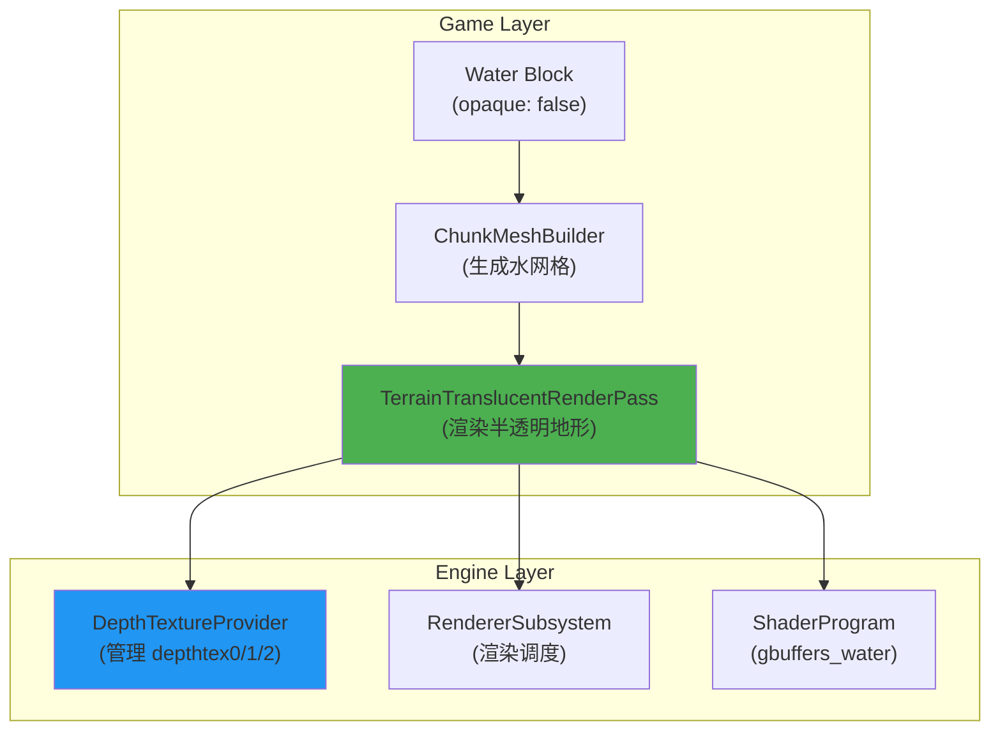
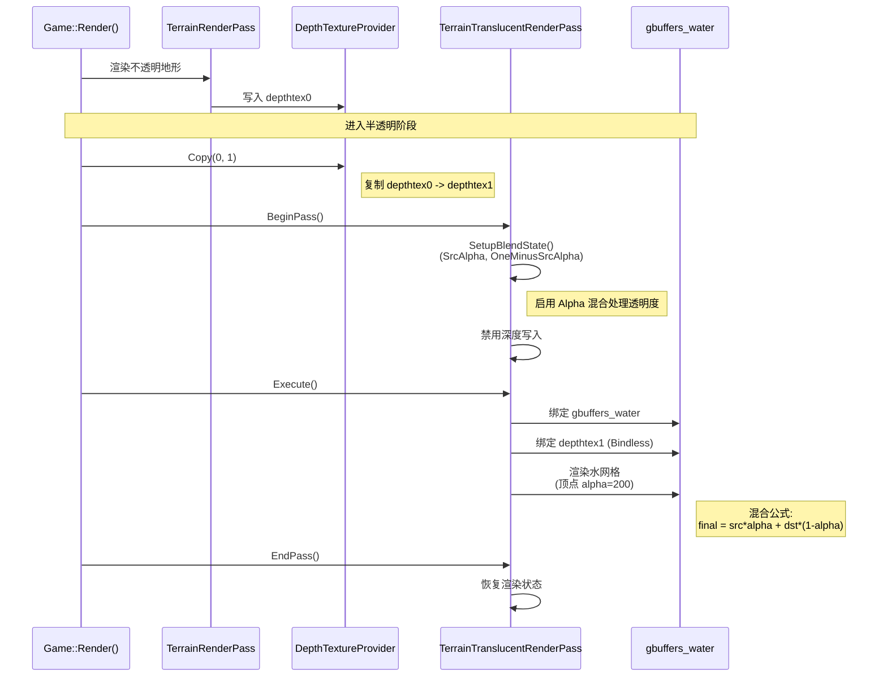

# Design Document - Deferred Rendering Production Water

## Overview

本设计文档详细说明 Minecraft 原版风格水渲染系统的技术实现方案，专注于延迟渲染管线和 gbuffer 处理。

**设计目标**:
- 实现 Iris 兼容的半透明地形渲染管线
- 正确处理深度纹理（depthtex0/depthtex1）
- 复用现有架构（TerrainVertexLayout、DepthTextureProvider）
- 支持 gbuffers_water 着色器程序

## Architecture Overview

### System Components



### Data Flow



### 透明度处理机制

水的透明度通过以下三个层次控制：

1. **顶点 Alpha**（ChunkMeshBuilder）
   - 在生成水网格时，设置顶点颜色的 alpha 通道
   - 默认值：200/255 ≈ 78% 不透明度
   - 位置：`TerrainVertex.m_color.a`

2. **混合模式**（TerrainTranslucentRenderPass）
   - 在 `SetupBlendState()` 中设置 `BlendMode::ALPHA`
   - D3D12 混合公式：`finalColor = srcColor * srcAlpha + dstColor * (1 - srcAlpha)`
   - 这使得水下物体可以透过水面看到

3. **Shader 调整**（gbuffers_water.ps.hlsl）
   - Pixel Shader 可以根据深度、角度等因素动态调整 alpha
   - 例如：水越深，透明度越低（未来扩展）

## Source Code Verification

为确保我们的水渲染实现符合Iris/Sodium标准，我们对源码进行了深入调查。以下是关键发现：

### Iris Shader Program Mapping

**源文件**: `Iris-multiloader-new/common/src/main/java/net/irisshaders/iris/pipeline/programs/ShaderKey.java:32`

```java
TERRAIN_TRANSLUCENT(
    ProgramId.TerrainTranslucent,
    WorldRenderingPhase.TRANSLUCENT_TERRAIN,
    IrisVertexFormats.TERRAIN,
    AlphaTest.ALWAYS,
    FogMode.PER_VERTEX,
    true  // hasChunkOffset
)
```

**关键信息**:
- 使用 `IrisVertexFormats.TERRAIN` 顶点格式（与不透明地形相同）
- 渲染阶段：`WorldRenderingPhase.TRANSLUCENT_TERRAIN`
- Alpha测试：`ALWAYS`（始终通过，由混合模式控制透明度）
- 支持Chunk偏移优化

### IrisVertexFormats.TERRAIN 完整顶点格式

**源文件**: `Iris-multiloader-new/common/src/main/java/net/irisshaders/iris/vertices/IrisVertexFormats.java`

```java
public static final VertexFormat TERRAIN = new VertexFormat(ImmutableMap.builder()
    .put("Position", VertexFormatElement.POSITION)      // vec3 - 顶点位置
    .put("Color", VertexFormatElement.COLOR)            // vec4 - 顶点颜色 + alpha
    .put("UV0", VertexFormatElement.UV0)                // vec2 - 纹理坐标
    .put("UV2", VertexFormatElement.UV2)                // vec2 - 光照贴图坐标 (lmCoord)
    .put("Normal", VertexFormatElement.NORMAL)          // vec3 - 法线
    .put("mc_Entity", ENTITY_ELEMENT)                   // short - 方块ID (用于材质识别)
    .put("mc_midTexCoord", MID_TEX_COORD_ELEMENT)       // vec2 - 纹理中心坐标
    .put("at_tangent", TANGENT_ELEMENT)                 // vec4 - 切线 (TBN矩阵)
    .put("at_midBlock", MID_BLOCK_ELEMENT)              // vec3 - 方块中心坐标
    .build());
```

**与我们当前TerrainVertex的对比**:

| Iris属性 | 我们的TerrainVertex | 状态 | 说明 |
|---------|-------------------|------|------|
| Position | ✅ m_position | 已有 | Vec3 |
| Color | ✅ m_color | 已有 | Rgba8 |
| UV0 | ✅ m_uvTexCoords | 已有 | Vec2 |
| UV2 | ✅ m_lightmapCoord | 已有 | Vec2 |
| Normal | ✅ m_normal | 已有 | Vec3 |
| mc_Entity | ❌ 缺失 | **需要添加** | short - 方块ID |
| mc_midTexCoord | ❌ 缺失 | **需要添加** | Vec2 - 纹理中心 |
| at_tangent | ❌ 缺失 | **需要添加** | Vec4 - 切线 |
| at_midBlock | ❌ 缺失 | **需要添加** | Vec3 - 方块中心 |

### 方块ID系统设计

**问题**: Iris使用`mc_Entity`（方块ID）来识别不同方块类型，我们如何获取和管理这些ID？

**解决方案**: 使用引擎的BlockRegistry自动生成ID系统

#### 方案对比

| 方案 | 优点 | 缺点 | 推荐度 |
|------|------|------|--------|
| **方案1: 自动生成ID** | ✅ 无需手动维护<br/>✅ 避免ID冲突<br/>✅ 符合引擎架构 | ⚠️ ID不固定（重启后可能变化） | ⭐⭐⭐⭐⭐ **推荐** |
| 方案2: YAML手动定义 | ✅ ID固定不变<br/>✅ 便于调试 | ❌ 需要手动维护<br/>❌ 容易冲突<br/>❌ 违反DRY原则 | ⭐⭐ 不推荐 |
| 方案3: 混合模式 | ✅ 关键方块ID固定<br/>✅ 其他方块自动生成 | ❌ 复杂度高<br/>❌ 维护成本高 | ⭐⭐⭐ 可选 |

#### 推荐实现：自动生成ID（方案1）

**架构说明**:

我们的引擎已经有完善的BlockRegistry系统（`Engine/Registry/Block/BlockRegistry.hpp`），它提供：

```cpp
// 自动分配数字ID（注册顺序决定）
static int GetBlockId(const std::string& name);
static int GetBlockId(const std::string& namespaceName, const std::string& name);

// 通过ID快速查询方块（O(1)性能）
static std::shared_ptr<Block> GetBlockById(int id);
```

**工作流程**:

1. **注册阶段**（引擎启动时）:
   ```cpp
   // SimpleMinerMod.cpp
   BlockRegistry::RegisterBlock("simpleminer", "water", std::make_shared<Block>("water", "simpleminer"));
   BlockRegistry::RegisterBlock("simpleminer", "stone", std::make_shared<Block>("stone", "simpleminer"));
   // ... 其他方块
   ```

2. **ID分配**（自动）:
   - BlockRegistry按注册顺序自动分配ID：0, 1, 2, ...
   - 水方块ID = `BlockRegistry::GetBlockId("simpleminer", "water")`
   - 例如：water=0, stone=1, grass=2, ...

3. **网格生成时**（ChunkMeshBuilder）:
   ```cpp
   void ChunkMeshBuilder::AddWaterTopFace(const BlockPos& pos, const Block& block)
   {
       // 直接从Block对象获取注册ID（IRegistrable::GetNumericId()）
       int blockId = block.GetNumericId();
       
       // 设置到顶点数据
       v0.m_entityId = static_cast<uint16_t>(blockId);
       v1.m_entityId = static_cast<uint16_t>(blockId);
       v2.m_entityId = static_cast<uint16_t>(blockId);
       v3.m_entityId = static_cast<uint16_t>(blockId);
   }
   ```

3. **Shader中使用**:
   ```hlsl
   // gbuffers_water.ps.hlsl
   // BlockID已经通过顶点数据传递到input.entityId
   if (input.entityId == 0)  // 假设水方块ID=0
   {
       // 应用水特效
   }
   ```

**关键设计决策**:

1. **不使用固定ID（如32000）**:
   - Iris的32000是Minecraft原版的方块ID
   - 我们的引擎使用自己的ID系统（从0开始）
   - 避免硬编码，保持灵活性

2. **ID传递方式**:
   - BlockID通过**顶点数据**传递（`TerrainVertex.m_entityId`）
   - 每个顶点携带所属方块的ID
   - Shader直接从顶点输入读取，无需额外Uniform

3. **ID范围**:
   - 使用`uint16_t`（0-65535）足够容纳所有方块类型
   - 与Iris的`short`类型兼容

3. **ID稳定性**:
   - 同一次运行中ID保持不变
   - 不同运行可能变化（取决于注册顺序）
   - 对于Shader来说无影响（每个顶点都携带正确的ID）

**实现示例**:

```cpp
// ChunkMeshBuilder.hpp
class ChunkMeshBuilder
{
public:
    ChunkMeshBuilder(Chunk* chunk)
    {
        // 无需缓存ID，直接从Block对象获取即可
    }
    
    void AddWaterTopFace(const BlockPos& pos, const Block& block)
    {
        // 直接使用Block::GetNumericId()（继承自IRegistrable）
        int blockId = block.GetNumericId();
        v0.m_entityId = static_cast<uint16_t>(blockId);
        // ...
    }
};
```

**Shader材质检测**:

```hlsl
// gbuffers_water.ps.hlsl

// 定义材质ID常量（可以从Uniform传入）
cbuffer MaterialIds : register(b2)
{
    uint g_waterBlockId;   // 运行时从BlockRegistry获取
    uint g_glassBlockId;
    uint g_iceBlockId;
};

PSOutput main(PSInput input)
{
    // 检测水方块
    if (input.entityId == g_waterBlockId)
    {
        // 应用水特效
    }
    
    // 检测玻璃
    if (input.entityId == g_glassBlockId)
    {
        // 应用玻璃特效
    }
}
```

**优势总结**:

✅ **符合引擎架构** - 复用现有BlockRegistry系统  
✅ **零维护成本** - 无需手动管理ID  
✅ **避免冲突** - 自动分配保证唯一性  
✅ **高性能** - Block对象直接携带ID（`GetNumericId()`）  
✅ **灵活扩展** - 新增方块无需修改ID配置  
✅ **顶点传递** - BlockID通过顶点数据传递，无需额外Uniform

**注意事项**:

⚠️ **ID不固定** - 不同运行可能变化，不要依赖具体数值  
⚠️ **顶点数据传递** - BlockID存储在`TerrainVertex.m_entityId`中  
⚠️ **调试友好** - 可以在日志中输出ID映射表

### Complementary Shaders 水着色器示例

**源文件**: `Complementary_Shaders/shaders/program/gbuffers_water.glsl`

**Vertex Shader 输入**:
```glsl
in vec3 vaPosition;        // Position
in vec4 vaColor;           // Color
in vec2 vaUV0;             // UV0
in ivec2 vaUV2;            // UV2 (lightmap)
in vec3 vaNormal;          // Normal
in int mc_Entity;          // [IMPORTANT] 方块ID
in vec2 mc_midTexCoord;    // [IMPORTANT] 纹理中心
in vec4 at_tangent;        // [IMPORTANT] 切线
```

**Fragment Shader 输出**:
```glsl
/* DRAWBUFFERS:03 */
layout(location = 0) out vec4 colortex0;  // 颜色 + alpha
layout(location = 1) out vec4 colortex3;  // 法线 + 材质ID
```

**水材质特殊处理**:
```glsl
// Fragment Shader
if (mat == 32000) {  // [CRITICAL] 水方块材质ID（Iris原版标准）
    // 注意：我们的引擎使用自动生成ID，不使用固定32000
    // 实际实现中应该通过Uniform传递BlockID
    
    // 1. 法线生成（使用TBN矩阵）
    vec3 normalMap = texture(normals, texCoord).xyz * 2.0 - 1.0;
    vec3 worldNormal = tbnMatrix * normalMap;
    
    // 2. 透明度计算
    float waterAlpha = color.a * 0.8;  // 基础透明度
    waterAlpha *= (1.0 - fresnel);     // 菲涅尔效果
    
    // 3. 泡沫效果
    float foam = texture(normals, texCoord * 4.0).a;
    color.rgb = mix(color.rgb, vec3(1.0), foam * 0.5);
    
    // 4. 输出材质ID
    colortex3.a = 32000.0 / 65535.0;  // 归一化材质ID
}
```

**我们的实现差异**:
- Iris使用固定ID（32000=水）
- 我们使用BlockRegistry自动生成ID（见下方"方块ID系统设计"）
- BlockID通过顶点数据传递（`m_entityId`字段），无需Uniform

### Sodium FluidRenderer 架构

**源文件**: `Sodium/src/main/java/net/caffeinemc/mods/sodium/client/render/chunk/compile/pipeline/DefaultFluidRenderer.java`

**关键实现**:

1. **面剔除逻辑**:
```java
private boolean isSideExposed(BlockAndTintGetter world, int x, int y, int z, Direction dir) {
    BlockPos pos = scratchPos.set(x, y, z).move(dir);
    BlockState neighbor = world.getBlockState(pos);
    
    // 如果邻居是完整不透明方块，不渲染该面
    if (neighbor.isSolidRender(world, pos)) {
        return false;
    }
    
    // 如果邻居也是流体，检查高度
    FluidState neighborFluid = neighbor.getFluidState();
    return neighborFluid.isEmpty() || neighborFluid.getHeight() < 0.8F;
}
```

2. **水面高度计算（四角）**:
```java
private void calculateCornerHeights(FluidState state, BlockPos pos) {
    float nw = getCornerHeight(world, pos, Direction.NORTH, Direction.WEST);
    float ne = getCornerHeight(world, pos, Direction.NORTH, Direction.EAST);
    float sw = getCornerHeight(world, pos, Direction.SOUTH, Direction.WEST);
    float se = getCornerHeight(world, pos, Direction.SOUTH, Direction.EAST);
    
    // 四个角的高度可能不同（流动水）
}
```

3. **UV旋转（基于流速）**:
```java
private void rotateUV(float[] uv, FluidState state) {
    Vector2f velocity = state.getFlow();
    float angle = (float) Math.atan2(velocity.y, velocity.x);
    // 根据流动方向旋转UV
}
```

### 实现建议总结

基于源码验证，我们的实现需要：

1. **[REQUIRED] 扩展顶点格式**:
   - 添加 `mc_Entity` (uint16_t) - 用于材质ID识别（通过Block::GetNumericId()获取）
   - 添加 `mc_midTexCoord` (Vec2) - 纹理中心坐标
   - **Phase 1不添加`at_tangent`**（当前不需要法线贴图）
   - **Phase 2可选添加`at_midBlock`**（高级特性）

2. **[REQUIRED] 方块ID系统**:
   - 使用BlockRegistry自动生成ID（不使用Iris的固定32000）
   - 直接从Block对象获取ID（`block.GetNumericId()`）
   - BlockID通过顶点数据传递（`m_entityId`字段）
   - Shader直接从顶点输入读取BlockID

3. **[REQUIRED] Shader材质ID系统**:
   - 在ChunkMeshBuilder中设置 `m_entityId = block.GetNumericId()`
   - Shader从顶点输入读取 `input.entityId`
   - 输出材质ID到 `colortex3.a`

4. **[OPTIONAL] TBN矩阵支持**:
   - **Phase 1不需要**（当前不使用法线贴图）
   - 如果Phase 2需要法线贴图，再添加`m_tangent`
   - 在Vertex Shader中计算TBN矩阵
   - 用于法线贴图变换

5. **[OPTIONAL] 高级特性**:
   - 四角高度计算（流动水）
   - UV旋转（流动方向）
   - 菲涅尔效果
   - 泡沫效果

### 源码参考文件列表

| 文件路径 | 行号 | 说明 |
|---------|------|------|
| `ShaderKey.java` | 32 | TERRAIN_TRANSLUCENT配置 |
| `IrisVertexFormats.java` | - | TERRAIN顶点格式定义 |
| `Complementary_Shaders/gbuffers_water.glsl` | - | 水着色器完整实现 |
| `DefaultFluidRenderer.java` | - | Sodium水渲染优化 |
| `WorldRenderingPhase.java` | - | 渲染阶段定义 |

---

## Component Design

### 1. Water Block Configuration

**文件**: `Run/.enigma/data/simpleminer/block/water.yml`

**设计决策**:
- 设置 `opaque: false` 标记为半透明方块
- 添加 `render_type: translucent` 显式指定渲染类型
- 保持与 Minecraft 原版行为一致

**配置示例**:
```yaml
# water.yml
name: water
opaque: false           # [CHANGED] 从 true 改为 false
render_type: translucent  # [NEW] 显式指定渲染类型
solid: false
light_level: 0
```

**实现位置**: 无需代码修改，仅配置文件变更

---

### 2. TerrainTranslucentRenderPass

**文件**: 
- `Code/Game/Framework/RenderPass/RenderTerrainTranslucent/TerrainTranslucentRenderPass.hpp`
- `Code/Game/Framework/RenderPass/RenderTerrainTranslucent/TerrainTranslucentRenderPass.cpp`

**类设计**:

```cpp
// TerrainTranslucentRenderPass.hpp
#pragma once
#include "Game/Framework/RenderPass/SceneRenderPass.hpp"

class TerrainTranslucentRenderPass : public SceneRenderPass
{
public:
    TerrainTranslucentRenderPass();
    virtual ~TerrainTranslucentRenderPass() override;

    // SceneRenderPass interface
    virtual void BeginPass() override;
    virtual void Execute() override;
    virtual void EndPass() override;

private:
    void SetupBlendState();
    void SetupDepthState();
    void RestoreRenderState();
    
    ShaderProgram* m_waterShader = nullptr;  // gbuffers_water
    ShaderProgram* m_fallbackShader = nullptr;  // gbuffers_terrain
    
    // 保存的渲染状态（用于恢复）
    bool m_savedDepthWriteEnabled = true;
    BlendMode m_savedBlendMode = BlendMode::OPAQUE;
};
```

**核心方法实现**:

```cpp
// TerrainTranslucentRenderPass.cpp

void TerrainTranslucentRenderPass::BeginPass()
{
    // 1. 复制深度纹理 depthtex0 -> depthtex1
    DepthTextureProvider* depthProvider = g_theRendererSubsystem->GetDepthTextureProvider();
    depthProvider->Copy(0, 1);
    
    // 2. 保存当前渲染状态
    m_savedDepthWriteEnabled = g_theRendererSubsystem->IsDepthWriteEnabled();
    m_savedBlendMode = g_theRendererSubsystem->GetBlendMode();
    
    // 3. 设置半透明渲染状态
    SetupBlendState();
    SetupDepthState();
    
    // 4. 加载着色器（带 fallback）
    m_waterShader = g_theRendererSubsystem->GetShaderProgram("gbuffers_water");
    if (!m_waterShader)
    {
        m_waterShader = g_theRendererSubsystem->GetShaderProgram("gbuffers_terrain");
        // [LOG] Warning: gbuffers_water not found, using gbuffers_terrain
    }
}

void TerrainTranslucentRenderPass::SetupBlendState()
{
    // 启用 Alpha 混合（处理水的透明度）
    g_theRendererSubsystem->SetBlendMode(BlendMode::ALPHA);
    // 等价于 D3D12: 
    // - SrcBlend = SRC_ALPHA (使用源颜色的 alpha)
    // - DestBlend = ONE_MINUS_SRC_ALPHA (使用 1-alpha 混合背景)
    // - 公式: finalColor = srcColor * srcAlpha + dstColor * (1 - srcAlpha)
    
    // 水的透明度来源：
    // 1. 顶点颜色的 alpha 通道（ChunkMeshBuilder 中设置）
    // 2. 纹理的 alpha 通道（water_still.png）
    // 3. Shader 中可进一步调整（如深度衰减）
}

void TerrainTranslucentRenderPass::SetupDepthState()
{
    // 启用深度测试，但禁用深度写入
    g_theRendererSubsystem->SetDepthTestEnabled(true);
    g_theRendererSubsystem->SetDepthWriteEnabled(false);
    g_theRendererSubsystem->SetDepthCompareFunc(CompareFunc::LESS_EQUAL);
}

void TerrainTranslucentRenderPass::Execute()
{
    // 绑定着色器
    g_theRendererSubsystem->BindShaderProgram(m_waterShader);
    
    // 绑定 depthtex1 (通过 Bindless)
    DepthTextureProvider* depthProvider = g_theRendererSubsystem->GetDepthTextureProvider();
    uint32_t depthtex1Index = depthProvider->GetMainTextureIndex(1);
    // Shader 通过 Bindless index 自动访问
    
    // 渲染所有半透明地形 Chunk
    World* world = g_theGame->GetWorld();
    const std::vector<Chunk*>& visibleChunks = world->GetVisibleChunks();
    
    for (Chunk* chunk : visibleChunks)
    {
        if (chunk->HasTranslucentMesh())
        {
            g_theRendererSubsystem->DrawMesh(chunk->GetTranslucentMesh());
        }
    }
}

void TerrainTranslucentRenderPass::EndPass()
{
    // 恢复渲染状态
    RestoreRenderState();
}

void TerrainTranslucentRenderPass::RestoreRenderState()
{
    g_theRendererSubsystem->SetDepthWriteEnabled(m_savedDepthWriteEnabled);
    g_theRendererSubsystem->SetBlendMode(m_savedBlendMode);
}
```

**设计要点**:
- 继承 `SceneRenderPass` 基类，符合现有架构
- 使用 `DepthTextureProvider::Copy(0, 1)` 复制深度
- 保存和恢复渲染状态，避免影响后续 Pass
- 支持 shader fallback（gbuffers_water -> gbuffers_terrain）

---

### 3. Depth Texture Management

**使用现有 API**: `Engine/Graphic/Target/DepthTextureProvider.hpp`

**集成方式**:

```cpp
// 在 TerrainTranslucentRenderPass::BeginPass() 中调用
DepthTextureProvider* depthProvider = g_theRendererSubsystem->GetDepthTextureProvider();

// 复制 depthtex0 -> depthtex1
depthProvider->Copy(0, 1);

// 获取 Bindless index（Shader 自动访问）
uint32_t depthtex1Index = depthProvider->GetMainTextureIndex(1);
```

**Shader 访问**:

```hlsl
// gbuffers_water.ps.hlsl
Texture2D depthtex1 : register(t0, space1);  // Bindless 纹理
SamplerState samplerLinear : register(s0);

float4 main(PSInput input) : SV_Target
{
    // 采样 depthtex1 获取不透明物体深度
    float opaqueDepth = depthtex1.Sample(samplerLinear, input.uv).r;
    
    // 实现水下折射等效果
    // ...
}
```

**设计要点**:
- 完全复用现有 `DepthTextureProvider` API
- 无需修改引擎代码
- Shader 通过 Bindless 自动访问深度纹理

---

### 4. Water Vertex Data

#### 4.1 扩展顶点格式（基于Iris验证）

**文件**: `Engine/Voxel/World/TerrainVertexLayout.hpp`

根据Iris源码验证（`IrisVertexFormats.TERRAIN`），我们需要扩展现有顶点格式：

```cpp
struct TerrainVertex {
    // [EXISTING] 基础属性（44 bytes）
    Vec3  m_position;      // 12 bytes - 顶点位置
    Rgba8 m_color;         // 4 bytes  - 水颜色 + 透明度
    Vec2  m_uvTexCoords;   // 8 bytes  - UV 坐标
    Vec3  m_normal;        // 12 bytes - 法线
    Vec2  m_lightmapCoord; // 8 bytes  - 光照贴图坐标 (UV2)
    
    // [NEW] Iris兼容扩展属性（Phase 1: 10 bytes）
    uint16_t m_entityId;   // 2 bytes  - mc_Entity: 方块ID
    Vec2  m_midTexCoord;   // 8 bytes  - mc_midTexCoord: 纹理中心坐标
    
    // [OPTIONAL] Phase 2扩展（仅在需要法线贴图时添加）
    // Vec4  m_tangent;    // 16 bytes - at_tangent: 切线向量（TBN矩阵）
    
    // [OPTIONAL] Phase 3扩展（高级特性）
    // Vec3 m_midBlock;    // 12 bytes - at_midBlock: 方块中心坐标
    
    // Total: 54 bytes (Phase 1)
    // Total: 70 bytes (Phase 2 with tangent)
    // Total: 82 bytes (Phase 3 with midBlock)
};
```

**设计决策**:

| 属性 | 用途 | 是否必需 | 说明 |
|------|------|---------|------|
| `m_entityId` | 材质识别 | ✅ **必需** | Shader中检测方块类型应用特效 |
| `m_midTexCoord` | 纹理中心 | ✅ **必需** | 用于纹理动画和采样优化 |
| `m_tangent` | TBN矩阵 | ⚠️ **可选** | 仅在使用法线贴图时需要 |
| `m_midBlock` | 方块中心 | ⚠️ **可选** | 用于高级效果（波浪、泡沫） |

**关于TBN矩阵的说明**:
- **当前不需要**: 我们已经在Vertex Shader中将normal转换到世界空间（gbuffers_terrain.vs.hlsl:72）
- **何时需要**: 仅当实现法线贴图（Normal Mapping）时才需要TBN矩阵
- **Iris兼容性**: Iris提供`at_tangent`是为了支持法线贴图，但不是必需的
- **推荐策略**: Phase 1不添加`m_tangent`，Phase 2根据需要添加

**实现策略**:
- **Phase 1**: 仅添加 `m_entityId` 和 `m_midTexCoord`（最小化修改）
- **Phase 2**: 如果需要法线贴图，再添加 `m_tangent`
- **Phase 3**: 根据需要添加 `m_midBlock`（高级特性）

#### 4.2 顶点数据生成（更新）

**ChunkMeshBuilder 扩展（包含Iris属性）**:

```cpp
// ChunkMeshBuilder.cpp

void ChunkMeshBuilder::AddWaterBlock(const BlockPos& pos, const Block& block)
{
    // 1. 判断是否需要生成面（邻居检测）
    bool shouldRenderTop = ShouldRenderWaterFace(pos, Direction::UP);
    bool shouldRenderBottom = ShouldRenderWaterFace(pos, Direction::DOWN);
    // ... 其他方向
    
    // 2. 生成顶点数据
    if (shouldRenderTop)
    {
        AddWaterTopFace(pos, block);
    }
    // ... 其他面
    
    // 3. 添加到半透明网格
    m_translucentVertices.push_back(vertex);
}

void ChunkMeshBuilder::AddWaterTopFace(const BlockPos& pos, const Block& block)
{
    // 水面高度固定为完整方块
    float waterHeight = 1.0f;
    
    // 生成 4 个顶点
    TerrainVertex v0, v1, v2, v3;
    
    // 位置
    v0.m_position = Vec3(pos.x, pos.y, pos.z + waterHeight);
    v1.m_position = Vec3(pos.x + 1, pos.y, pos.z + waterHeight);
    v2.m_position = Vec3(pos.x + 1, pos.y + 1, pos.z + waterHeight);
    v3.m_position = Vec3(pos.x, pos.y + 1, pos.z + waterHeight);
    
    // 颜色（水颜色 + 透明度）
    // RGB: 默认海洋蓝 (63, 118, 228)
    // Alpha: 200 (约 78% 透明度，允许看到水下物体)
    Rgba8 waterColor = Rgba8(63, 118, 228, 200);  // Ocean blue + alpha
    v0.m_color = v1.m_color = v2.m_color = v3.m_color = waterColor;
    
    // 注意：最终透明度 = 顶点 alpha × 纹理 alpha × shader 调整
    // 这个 alpha 值会在 SetupBlendState() 设置的混合模式下生效
    
    // UV 坐标（从 Atlas 获取）
    AABB2 waterUV = g_theGame->GetBlockAtlas()->GetSprite("water_still").uvBounds;
    v0.m_uvTexCoords = Vec2(waterUV.mins.x, waterUV.mins.y);
    v1.m_uvTexCoords = Vec2(waterUV.maxs.x, waterUV.mins.y);
    v2.m_uvTexCoords = Vec2(waterUV.maxs.x, waterUV.maxs.y);
    v3.m_uvTexCoords = Vec2(waterUV.mins.x, waterUV.maxs.y);
    
    // 法线（向上）
    Vec3 normal = Vec3(0, 0, 1);
    v0.m_normal = v1.m_normal = v2.m_normal = v3.m_normal = normal;
    
    // 光照贴图坐标
    Vec2 lightmapCoord = CalculateLightmapCoord(pos);
    v0.m_lightmapCoord = v1.m_lightmapCoord = v2.m_lightmapCoord = v3.m_lightmapCoord = lightmapCoord;
    
    // [NEW] Iris兼容属性
    // 1. 材质ID（水方块标识）
    // 直接从Block对象获取注册ID（IRegistrable::GetNumericId()）
    int blockId = block.GetNumericId();
    v0.m_entityId = v1.m_entityId = v2.m_entityId = v3.m_entityId = static_cast<uint16_t>(blockId);
    
    // 2. 纹理中心坐标（用于动画和采样）
    Vec2 midTexCoord = Vec2(
        (waterUV.mins.x + waterUV.maxs.x) * 0.5f,
        (waterUV.mins.y + waterUV.maxs.y) * 0.5f
    );
    v0.m_midTexCoord = v1.m_midTexCoord = v2.m_midTexCoord = v3.m_midTexCoord = midTexCoord;
    
    // 注意：Phase 1不添加m_tangent（当前不需要法线贴图）
    // 如果Phase 2需要法线贴图，再添加以下代码：
    // Vec3 tangent = Vec3(1, 0, 0);  // 水平面切线指向X轴
    // float handedness = 1.0f;  // 右手坐标系
    // v0.m_tangent = Vec4(tangent.x, tangent.y, tangent.z, handedness);
    
    // 添加到半透明网格
    m_translucentVertices.push_back(v0);
    m_translucentVertices.push_back(v1);
    m_translucentVertices.push_back(v2);
    m_translucentVertices.push_back(v3);
    
    // 添加索引（两个三角形）
    AddQuadIndices(m_translucentIndices, m_translucentVertices.size() - 4);
}

bool ChunkMeshBuilder::ShouldRenderWaterFace(const BlockPos& pos, Direction dir)
{
    BlockPos neighborPos = pos + GetDirectionOffset(dir);
    Block neighborBlock = m_chunk->GetBlock(neighborPos);
    
    // 如果邻居是空气或非完整方块，渲染该面
    if (neighborBlock.IsAir() || !neighborBlock.IsOpaque())
    {
        return true;
    }
    
    // 如果邻居也是水，不渲染该面（避免 Z-Fighting）
    if (!neighborBlock.IsOpaque())
    {
        return false;
    }
    
    return true;
}
```

**设计要点**:
- 扩展 `TerrainVertex` 结构，添加Iris兼容属性
- `m_entityId` 使用Block对象直接获取（`block.GetNumericId()`）
- `m_midTexCoord` 用于纹理动画和采样优化
- **Phase 1不添加`m_tangent`**（当前不需要法线贴图）
- 水面高度固定为完整方块（1.0）
- 邻居检测避免 Z-Fighting

**关于Normal处理**:
- 当前架构已经在Vertex Shader中将normal转换到世界空间
- 参考：`gbuffers_terrain.vs.hlsl:72` - `normalize(mul((float3x3)modelMatrix, input.Normal))`
- 不需要在Pixel Shader中再次转换
- TBN矩阵仅在使用法线贴图时需要

**TBN矩阵说明**:
```
当前不需要TBN矩阵，因为：
1. 我们已经在Vertex Shader中将normal转换到世界空间
2. TBN矩阵主要用于法线贴图（Normal Mapping）
3. Phase 1不实现法线贴图，因此不需要m_tangent

如果Phase 2需要法线贴图：
T (Tangent)   = (1, 0, 0) - 沿X轴
B (Bitangent) = (0, 1, 0) - 沿Y轴  
N (Normal)    = (0, 0, 1) - 沿Z轴（向上）
这个正交基用于将法线贴图从切线空间变换到世界空间。
```

---

## Shader Design

### gbuffers_water Vertex Shader（更新 - 支持Iris扩展属性）

**文件**: `Run/.enigma/assets/engine/shaders/program/gbuffers_water.vs.hlsl`

```hlsl
// gbuffers_water.vs.hlsl
#include "common_uniforms.hlsl"

struct VSInput
{
    float3 position : POSITION;
    float4 color : COLOR;
    float2 uv : TEXCOORD0;
    float3 normal : NORMAL;
    float2 lightmapCoord : TEXCOORD1;
    
    // [NEW] Iris兼容扩展属性
    uint entityId : TEXCOORD2;        // mc_Entity - 方块ID
    float2 midTexCoord : TEXCOORD3;   // mc_midTexCoord - 纹理中心
    float4 tangent : TEXCOORD4;       // at_tangent - 切线向量
};

struct PSInput
{
    float4 position : SV_Position;
    float4 color : COLOR;
    float2 uv : TEXCOORD0;
    float3 normal : NORMAL;
    float2 lightmapCoord : TEXCOORD1;
    float3 worldPos : TEXCOORD2;
    
    // [NEW] 传递给Pixel Shader
    uint entityId : TEXCOORD3;        // 材质ID
    float2 midTexCoord : TEXCOORD4;   // 纹理中心
    float3x3 tbnMatrix : TEXCOORD5;   // TBN矩阵（3个float3）
};

PSInput main(VSInput input)
{
    PSInput output;
    
    // 世界空间位置
    float4 worldPos = mul(float4(input.position, 1.0), g_modelMatrix);
    output.worldPos = worldPos.xyz;
    
    // 投影空间位置
    float4 viewPos = mul(worldPos, g_viewMatrix);
    output.position = mul(viewPos, g_projectionMatrix);
    
    // 传递基础属性
    output.color = input.color;
    output.uv = input.uv;
    output.normal = mul(input.normal, (float3x3)g_modelMatrix);
    output.lightmapCoord = input.lightmapCoord;
    
    // [NEW] 传递Iris扩展属性
    output.entityId = input.entityId;
    output.midTexCoord = input.midTexCoord;
    
    // [NEW] 构建TBN矩阵（用于法线贴图）
    float3 T = normalize(mul(input.tangent.xyz, (float3x3)g_modelMatrix));  // Tangent
    float3 N = normalize(output.normal);                                     // Normal
    float3 B = cross(N, T) * input.tangent.w;                               // Bitangent (考虑handedness)
    output.tbnMatrix = float3x3(T, B, N);
    
    return output;
}
```

**关键变更**:
- 添加 `entityId`, `midTexCoord`, `tangent` 输入属性
- 构建TBN矩阵用于法线贴图变换
- 传递材质ID到Pixel Shader用于特效识别

### gbuffers_water Pixel Shader（更新 - 支持材质ID系统）

**文件**: `Run/.enigma/assets/engine/shaders/program/gbuffers_water.ps.hlsl`

```hlsl
// gbuffers_water.ps.hlsl
#include "common_uniforms.hlsl"

Texture2D blockAtlas : register(t0);
Texture2D lightmapTexture : register(t1);
Texture2D depthtex1 : register(t2);  // Pre-translucent depth
SamplerState samplerLinear : register(s0);

struct PSInput
{
    float4 position : SV_Position;
    float4 color : COLOR;
    float2 uv : TEXCOORD0;
    float3 normal : NORMAL;
    float2 lightmapCoord : TEXCOORD1;
    float3 worldPos : TEXCOORD2;
    
    // [NEW] Iris扩展属性
    uint entityId : TEXCOORD3;        // 材质ID（通过顶点数据传递）
    float2 midTexCoord : TEXCOORD4;   // 纹理中心
    float3x3 tbnMatrix : TEXCOORD5;   // TBN矩阵
};

struct PSOutput
{
    float4 color : SV_Target0;     // colortex0 - 颜色 + alpha
    float4 material : SV_Target1;  // colortex3 - 法线 + 材质ID (可选)
};

PSOutput main(PSInput input)
{
    PSOutput output;
    
    // 采样纹理
    float4 texColor = blockAtlas.Sample(samplerLinear, input.uv);
    float4 lightmap = lightmapTexture.Sample(samplerLinear, input.lightmapCoord);
    
    // 应用顶点颜色（水颜色 + 透明度）
    float4 finalColor = texColor * input.color;
    
    // 应用光照
    finalColor.rgb *= lightmap.rgb;
    
    // [NEW] 检测水方块材质ID（从顶点数据读取）
    // 注意：具体ID值取决于BlockRegistry注册顺序
    // 这里假设水方块ID=0（实际值可能不同）
    if (input.entityId == 0)
    {
        // 水方块特殊处理（未来扩展）
        // 1. 法线贴图（使用TBN矩阵）
        // 2. 菲涅尔效果
        // 3. 泡沫效果
        // 4. 深度衰减
    }
    
    // 输出到 colortex0
    output.color = finalColor;
    
    // [OPTIONAL] 输出材质ID到 colortex3.a（用于后处理识别）
    output.material = float4(input.normal * 0.5 + 0.5, float(input.entityId) / 65535.0);
    
    return output;
}
```

**关键变更**:
- BlockID通过**顶点数据**传递（`input.entityId`）
- 直接从顶点输入读取BlockID，无需Uniform
- 输出材质ID到 `colortex3.a`（归一化到 [0,1]）
- **Phase 1不包含TBN矩阵**（当前不需要法线贴图）
- Normal已经是世界空间（在Vertex Shader中转换）

**数据流说明**:
```
ChunkMeshBuilder生成顶点
    ↓
设置 v0.m_entityId = block.GetNumericId()
设置 v0.m_midTexCoord = 纹理中心
    ↓
顶点数据上传到GPU
    ↓
Vertex Shader传递到Pixel Shader
    ↓
Pixel Shader读取 input.entityId
    ↓
根据BlockID应用不同材质效果
```

**与Iris的差异**:
- Iris使用固定ID映射（32000=水，10001=玻璃等）
- 我们使用BlockRegistry自动生成ID（0, 1, 2, ...）
- 两者都通过顶点数据传递BlockID（相同机制）

---

## Integration Points

### 1. Game Rendering Loop

```cpp
// Game.cpp

void Game::Render()
{
    // 1. 渲染不透明地形
    m_terrainRenderPass->BeginPass();
    m_terrainRenderPass->Execute();
    m_terrainRenderPass->EndPass();
    
    // 2. 渲染半透明地形（水）
    m_terrainTranslucentRenderPass->BeginPass();  // [NEW] 复制 depthtex0 -> depthtex1
    m_terrainTranslucentRenderPass->Execute();
    m_terrainTranslucentRenderPass->EndPass();
    
    // 3. 渲染其他半透明物体（粒子、云等）
    // ...
}
```

### 2. Chunk Mesh Generation

```cpp
// Chunk.cpp

void Chunk::RebuildMesh()
{
    ChunkMeshBuilder builder(this);
    
    for (int z = 0; z < CHUNK_HEIGHT; ++z)
    {
        for (int y = 0; y < CHUNK_SIZE_Y; ++y)
        {
            for (int x = 0; x < CHUNK_SIZE_X; ++x)
            {
                Block block = GetBlock(x, y, z);
                
                if (block.IsOpaque())
                {
                    builder.AddOpaqueBlock(BlockPos(x, y, z), block);
                }
                else  // 半透明方块（水、玻璃等）
                {
                    builder.AddTranslucentBlock(BlockPos(x, y, z), block);  // [NEW]
                }
            }
        }
    }
    
    // 上传网格
    m_opaqueMesh = builder.BuildOpaqueMesh();
    m_translucentMesh = builder.BuildTranslucentMesh();  // [NEW]
}
```

---

## Performance Considerations

### 1. Depth Copy Overhead

**问题**: 每帧复制 depthtex0 -> depthtex1 可能有性能开销

**优化方案**:
- 使用 GPU CopyResource（已由 DepthTextureProvider 实现）
- 仅在有半透明物体时执行复制
- 深度纹理格式使用 D24_UNORM_S8_UINT（标准格式）

**预期开销**: < 0.1ms @ 1080p

### 2. Blend State Switching

**问题**: 切换混合模式可能导致 GPU 管线停顿

**优化方案**:
- 批量渲染所有半透明地形
- 最小化状态切换次数
- 使用 PSO 缓存（已由 RendererSubsystem 实现）

### 3. Overdraw

**问题**: 半透明水面可能导致大量 overdraw

**优化方案**:
- 前向后排序（back-to-front）渲染半透明物体
- 邻居检测避免渲染不可见面
- 未来可考虑 OIT（Order-Independent Transparency）

**目标性能**: 水渲染开销 < 0.5ms @ 1080p

---

## Testing Strategy

### 1. Unit Tests

- `TerrainTranslucentRenderPass::SetupBlendState()` - 验证混合模式设置
- `TerrainTranslucentRenderPass::SetupDepthState()` - 验证深度状态设置
- `ChunkMeshBuilder::ShouldRenderWaterFace()` - 验证面剔除逻辑

### 2. Integration Tests

- 验证 depthtex0 -> depthtex1 复制正确性
- 验证 gbuffers_water shader fallback 机制
- 验证水网格生成正确性

### 3. Visual Tests

- 水面透明度正确显示
- 水下物体可见
- 无 Z-Fighting

---

## Implementation Order

### Phase 1: 基础架构（1-2天）
1. 修改 `water.yml` 配置
2. 创建 `TerrainTranslucentRenderPass` 类
3. 集成到 Game 渲染循环

### Phase 2: 网格生成（1-2天）
4. 扩展 `ChunkMeshBuilder` 支持水方块
5. 实现邻居检测和面剔除
6. 实现水面高度计算

### Phase 3: Shader 集成（1天）
7. 创建 `gbuffers_water.vs.hlsl`（包含entityId和midTexCoord）
8. 创建 `gbuffers_water.ps.hlsl`（包含材质ID系统）
9. 测试 shader fallback 机制

### Phase 4: 测试和优化（1天）
10. 性能测试和优化
11. 视觉测试和 bug 修复
12. 验证Iris兼容性

**总计**: 4-6 天（Phase 1最小化实现）

---

## Risk Assessment

### High Risk
- **深度纹理复制失败**: 如果 DepthTextureProvider::Copy() 有 bug，水渲染会出错
  - **缓解**: 提前测试 Copy() 功能，确保正确性
- **[NEW] 顶点格式不兼容**: 扩展TerrainVertex可能影响现有地形渲染
  - **缓解**: 分阶段添加属性，先测试最小化修改（仅entityId）

### Medium Risk
- **Shader 编译失败**: gbuffers_water shader 可能有语法错误
  - **缓解**: 参考现有 gbuffers_terrain shader，保持一致性

### Low Risk
- **性能不达标**: 水渲染开销超过 0.5ms
  - **缓解**: 实施上述优化方案，监控性能指标

---

## Future Enhancements

### Out of Scope (本 Spec)
- 水面动画（已移至 atlas-refactor-and-animation spec）
- 生物群系水颜色（已移至 atlas-refactor-and-animation spec）
- 水下折射效果
- 水面反射
- 水波纹模拟

### Potential Extensions
- 支持其他半透明方块（玻璃、冰、染色玻璃）
- Order-Independent Transparency (OIT)
- 水下雾效
- 焦散效果（caustics）

---

## References

### Internal Documents
- `F:\p4\Personal\SD\Thesis\.spec-workflow\specs\deferred-rendering-production-water\requirements.md`
- `F:\p4\Personal\SD\Thesis\Engine\Graphic\CLAUDE.md`

### External References
- Iris Shader Mod: `F:\p4\Personal\SD\Thesis\ReferenceProject\Iris-multiloader-new`
- Minecraft Source Code: `F:\p4\Personal\SD\Thesis\ReferenceProject\Minecraft Source Code`

### Key Source Files
- `Iris-multiloader-new/common/src/main/java/net/irisshaders/iris/pipeline/programs/ShaderKey.java:32` - TERRAIN_TRANSLUCENT配置
- `Iris-multiloader-new/common/src/main/java/net/irisshaders/iris/vertices/IrisVertexFormats.java` - TERRAIN顶点格式定义
- `Complementary_Shaders/shaders/program/gbuffers_water.glsl` - 水着色器完整实现
- `Sodium/src/main/java/net/caffeinemc/mods/sodium/client/render/chunk/compile/pipeline/DefaultFluidRenderer.java` - Sodium水渲染优化
- `Iris-multiloader-new/.../WorldRenderingPhase.java` - 渲染阶段定义
- `Engine/Graphic/Target/DepthTextureProvider.hpp` - 深度纹理管理
- `Engine/Voxel/World/TerrainVertexLayout.hpp` - 顶点格式（需扩展）

---

*Last Updated: 2026-01-17*
*Version: 2.0 (Iris Source Code Verified)*
*Status: Ready for Review*
